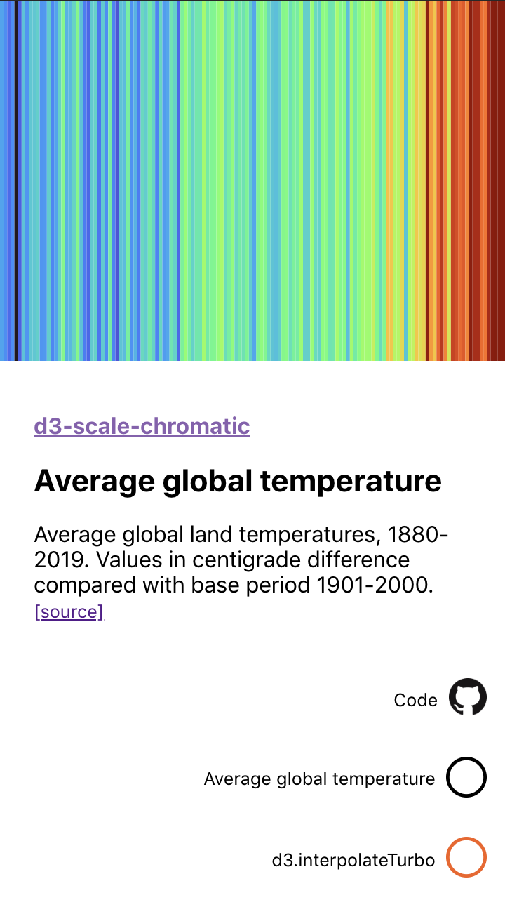
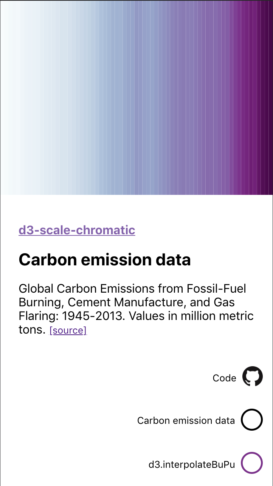
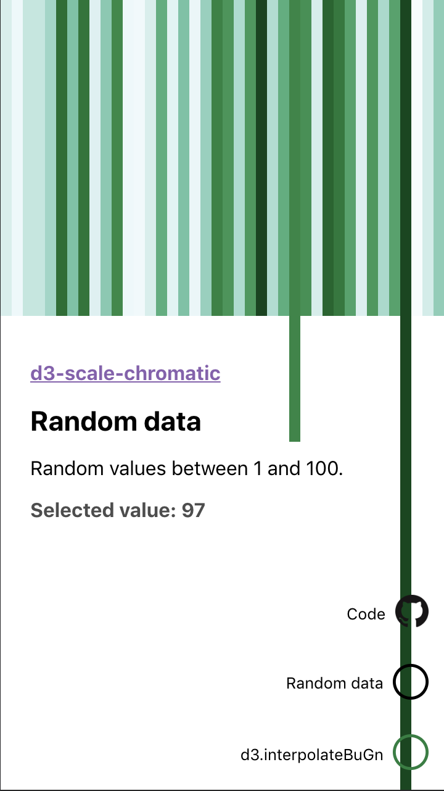

# Color graphs

> A display and demo of d3 color scales.


| Temperature scale | Monochromatic scale | SVG Line |
| --------------- | --------------- | --------------- |
|  |  |  |

Built with React, [styled-components](https://www.styled-components.com/), 
handsewn SVG and color scaling from [d3-scale-chromatic](https://www.npmjs.com/package/d3-scale-chromatic).  

## Setup
```
git clone git@github.com:tomfa/color-graph.git
yarn 
```

### Run
```
yarn start
```

### Test
```
yarn test
```

### Deploy
```
yarn deploy
```


## Usage
Color scales from d3-scale-chromatic can be used like this: 
```
// e.g. scale from white to blue
import { interpolateBlues } from "d3-scale-chromatic";

interpolatedBlues(0);
// -> "rgb(247, 251, 255)" (white)

interpolatedBlues(1);
// -> "rgb(8, 48, 107)" (blue)
```

Since the scale goes from 0 to 1, you'll have to normalize your data 
values before retrieving the graph color:

```
import { getNormalizer } from './src/utils/palette;

const data = [10, 20, 25, 30];
const normalizer = getNormalizer({ data });

const normalizedData = data.map(normalizer);
// -> [ 0, 0.5, 0.75, 1 ]
```

If you wish to work with the original data instead, you could generate a 
color function adapted to your data:
```
const getColor = originalValue => interPolatedBlues(normalizer(originalValue));

getColor(10); 
// -> "rgb(247, 251, 255)" (white) 

``` 
